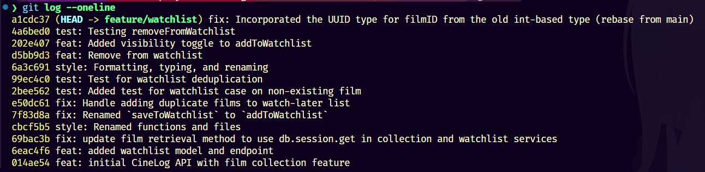

# PR Response Doc — CineLog Watchlist Feature

## AI Usage

Usage 1: I used Copilot to review the git log and make sure it is conventional formatting and any commit messages are clear and specific.

Usage 2: I used Gemini to help me understand how git rebasing works and how to resolve conflicts.

## Comment 1 - Rename
**What I did:** Went to where `saveToWatchlist()` was defined and used VSCodes "Rename Symbol" feature to rename it to `addToWatchlist()`. This feature automatically updates all references in a smart way (not a simple text replace).

**How I verified:** Simply ran test (from comment 3) and confirmed no errors.

## Comment 2 - Deduplication
**What I did:** Using `addToCollection` from `collectionService.py` as a reference, I added a check to see if the film is already in the user's watchlist. If it is, I raise a new exception called `AlreadyInWatchlistError` that I added.

**How I verified:** Wrote a new test called `test_addToWatchlistDuplicateFilmRaises()` in `test_watchlist.py` that attempts to add the same film twice and asserts that `AlreadyInWatchlistError` is raised. Ran the test and confirmed it passed, indicating that duplicates are now correctly handled.

## Comment 3 - Missing test
**What I did:** Using `test_addToCollectionNonexistentFilmRaises()` from `test_collection.py` as reference, I wrote a new test called `test_addToWatchlistNonexistentFilmRaises()` in `test_watchlist.py` (making sure to use integer instead of string for the current film ID type). The test attempts to add a film with a non-existent `filmId` to the watchlist and asserts that a `FilmNotFoundError` is raised.

**How I verified:** Ran the test and confirmed it passed, indicating that the error is correctly raised when a non-existent film ID is used.

## Comment 4 - Default visibility
**My position:** Public by default

**Reasoning:** Nowhere in CineLog's model treats user activity as private such as `CollectionEntry` ratings feed directly into `Film.averageRating`, a global aggregate, with no visibility field.
	The app's existing form assumes activity is shared by default, so a private-by-default watchlist would be a one-off exception with no precedent elsewhere. Additionally, a watchlist entry is lower-stakes than a rating where it is an intent to watch, not an already-watched film.
	If the more revealing data has no privacy guard, defaulting the less revealing signal to private is a contradiction.
	Furthermore, public watchlists can also also work as discovery features such as "friends also want to watch this", overlap between two users' lists, and trending unwatched titles.

**Tradeoff acknowledged:** Having a private default would protect users from exposing embarrassing films (or otherwise something that makes them uncomfortable having others see it) before they've watched it. The `public` field on `WatchlistEntry` already gives users an escape for such case, so defaulting to public doesn't remove privacy completely, it just opts users into the sharing state the rest of the app already assumes while leaving room to opt out.

## Comment 5 - Sort order
**My position:** Alphabetical order

**Reasoning:** A watchlist is a queue of intent (the intent to watch something later) where users open it for the answer "what should I watch?" or "is this film that I haven't watched already on my list?". Both are lookups that alphabetical order supports better than recency. The date a film was added to a watch-later list doesn't carry meaningful information (unlike a collection where the watch date is the data), so sorting by it just buries older-but-still-wanted films under newer ones as the list grows. Additionally, alphabetical order is also stable where a film's position barely shifts as new entries are added, which makes it easier to relocate a specific title on repeat visits. This also includes situation where a film is added (followed by subsequent adds and thus buried) then removed, then re-added.

**Engagement with reviewer's point:** The point that "most users want to see what they added recently" is a solid argument for lists that behave like a queue that is scrolled passively (which is exactly how collections work). However, a watchlist behaves differently in practice where interactions are targeted, such as findind a specific title or checking for duplicates before adding, rather than browsing. Since `date_added` is already tracked and returned in `getWatchlist()`, adding a `?sort=date_added` option later is a small, non-breaking change if users report otherwise.

## Comment 6 - Rebase
**What conflicted:** The watchlist code had been written against the old integer film ID shape, while `main` had already switched films to UUID strings. That meant the watchlist model and test fixtures were still using the wrong type.

**How I resolved it:** I updated the watchlist entry model to store `filmId` as a UUID string and changed the watchlist service, route docs, and tests to use UUID-shaped IDs consistently.

**How I verified no conflict remains:** I reran the watchlist test file after the edits and confirmed the UUID-based test data still passes.

## Stretch - Remove from watchlist

**What I did:** Implemented a `removeFromWatchlist(userId, filmId)` function that deletes the corresponding `WatchlistEntry` from the database. Added a new exception called `NotInWatchlistError` that is raised if the entry doesn't exist.

**How I verified:** Wrote a new test called `test_removeFromWatchlist()` in `test_watchlist.py` that adds a film to the watchlist, removes it, and asserts that it is no longer present. Also wrote `test_removeFromWatchlistNonexistentFilmRaises()` to assert that trying to remove a non-existent entry raises `NotInWatchlistError`. Ran the tests and confirmed they passed.

## Stretch - Additional test

**What I did:** Wrote several additional tests: `test_addToWatchlistDuplicateRaises()`, `test_addToWatchlistPublicDefaultsTrue()`, `test_addToWatchlistPublicCanBeSetFalse()`,
`test_removeFromWatchlistRemovesEntry()`,
and `test_removeFromWatchlistNonexistentFilmRaises()`.
I chose these tests to cover edge cases around duplicates, visibility defaults, and removal of entries, which are all important for ensuring the robustness of the watchlist feature.

## Stretch - Visibility toggle

**What I did:** Added a `public: bool = True` parameter to `addToWatchlist()` so callers can set visibility explicitly instead of relying on the model's default. The `True` default preserves the public-by-default decision from Comment 4 when the caller doesn't specify. Passed the value straight into the `WatchlistEntry` constructor rather than setting it after the fact, matching how `userId`/`filmId` are already handled.

Wired the `POST /watchlist/<user_id>/add` endpoint to accept an optional `"public"` key in the request body (`data.get("public", True)`), so existing callers that omit it are unaffected.

**How I verified:** Added `test_addToWatchlistPublicDefaultsTrue` and `test_addToWatchlistPublicCanBeSetFalse` to `test_watchlist.py`, covering both the default and the explicit override. Ran the full watchlist test suite (`pytest tests/test_watchlist.py`) and confirmed all 4 tests pass.

## PR Description
The watchlist feature lets a user save films they want to watch later, view them back in a list, and remove them when they are no longer interested. Each entry carries the user, film, created time, and visibility flag so the list can be shared or kept private on a per-entry basis.

Default visibility is public because CineLog already treats film activity as socially relevant, and a public watchlist supports discovery and overlap between users without taking away privacy entirely. Sort order is alphabetical because this watchlist is mainly used as a lookup queue, so stable title-based ordering makes it easier to find a specific film than shifting the list every time something new is added.

To test it manually, send a POST to `/watchlist/<user_id>/add` with a UUID `film_id`, confirm the response returns `201`, then GET `/watchlist/<user_id>` to see the saved film. Try the same add again to confirm duplicate detection, and call the remove path with the same UUID to confirm the entry disappears. You can also omit `public` to confirm the default is public, or set `public: false` to verify the override.

## Git Log

